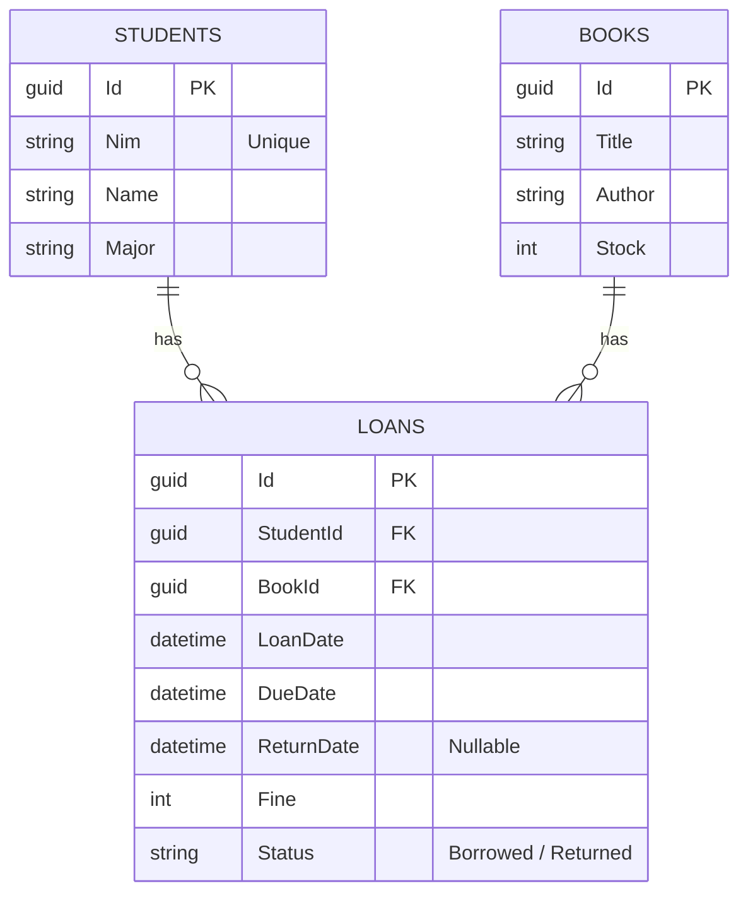

# 📚 Library Loan System API

[](https://dotnet.microsoft.com/download/dotnet/10.0)
[](https://www.postgresql.org/)
[](https://learn.microsoft.com/en-us/ef/core/)
[](https://swagger.io/)

Aplikasi **Library Loan System API** adalah RESTful API backend yang dirancang untuk mengelola proses peminjaman dan pengembalian buku di perpustakaan. Proyek ini dibangun menggunakan **ASP.NET Core (.NET 10.0)** dengan database **PostgreSQL** dan **Entity Framework Core** sebagai ORM.

---

## 🛠️ Teknologi & Pustaka (Tech Stack)

*   **Framework Utama**: .NET 10.0 (ASP.NET Core Web API)
*   **Database**: PostgreSQL
*   **ORM**: Entity Framework Core (EF Core 10.0)
*   **Database Provider**: Npgsql.EntityFrameworkCore.PostgreSQL
*   **Dokumentasi API**: Swagger / OpenAPI (Swashbuckle)
*   **Konfigurasi Environment**: DotNetEnv (Membaca file `.env`)

---

## 📋 Aturan Bisnis (Business Rules)

Aplikasi ini mengimplementasikan aturan bisnis sebagai berikut:
1.  **Batasan Peminjaman**: Setiap mahasiswa maksimal hanya boleh meminjam **3 buku secara bersamaan** (status peminjaman `Borrowed`).
2.  **Kontrol Stok Buku**:
    *   Buku hanya dapat dipinjam jika stok masih tersedia (> 0).
    *   Stok buku akan **berkurang 1** secara otomatis saat berhasil dipinjam.
    *   Stok buku akan **bertambah 1** secara otomatis saat berhasil dikembalikan.
3.  **Denda Keterlambatan**:
    *   Batas waktu peminjaman buku adalah **7 hari**.
    *   Jika pengembalian melewati batas tanggal jatuh tempo (`DueDate`), sistem secara otomatis menghitung denda sebesar **Rp 1.000,- per hari keterlambatan**.
4.  **Format Tanggal**: Respon tanggal disajikan menggunakan format tanggal Indonesia (`dd-MM-yyyy HH:mm:ss`).
5.  **Validasi Unik**: NIM Mahasiswa harus bersifat unik di dalam database.

---

## 📐 Arsitektur Database (Entity-Relationship Diagram)



---

## 🚀 Langkah-Langkah Instalasi & Menjalankan Aplikasi

Ikuti panduan berikut untuk menjalankan proyek ini di mesin lokal Anda:

### 1. Prasyarat (Prerequisites)
Pastikan Anda telah menginstal software berikut:
*   [SDK .NET 10](https://dotnet.microsoft.com/download/dotnet/10.0)
*   [PostgreSQL Database Server](https://www.postgresql.org/download/)
*   IDE seperti Visual Studio 2022, VS Code, atau JetBrains Rider.

### 2. Kloning Repositori
```bash
git clone https://github.com/muhamadtabina/library-loan-system-api.git
cd "Library Loan System"
```

### 3. Konfigurasi Environment (`.env`)
Di dalam folder proyek `Library Loan System`, buat atau sesuaikan file `.env` untuk mengatur koneksi ke database PostgreSQL Anda.

Contoh konfigurasi `.env`:
```env
DB_CONNECTION_STRING="Host=localhost;Port=5432;Database=library_loan_system_db;Username=postgres;Password=PASSWORD_ANDA"
```
*(Sesuaikan `PASSWORD_ANDA` dengan password database PostgreSQL lokal Anda)*

### 4. Jalankan Migrasi Database
Gunakan perintah Entity Framework Core CLI untuk membuat skema tabel di PostgreSQL:
```bash
# Pindah ke direktori project utama yang berisi file csproj
cd "Library Loan System"

# Jalankan update database
dotnet ef database update
```
> **Catatan**: menginstal tool EF secara global terlebih dahulu menggunakan perintah: `dotnet tool install --global dotnet-ef`

### 5. Jalankan Aplikasi
Jalankan perintah berikut untuk memulai server development:
```bash
dotnet run
```

### 6. Akses Swagger UI
Setelah aplikasi berjalan, buka browser dan akses link Swagger berikut untuk melihat dokumentasi interaktif dan mencoba API secara langsung:
```text
http://localhost:{port-pilihan}/swagger
```

---

## 🔌 Dokumentasi API Endpoint

Semua endpoint API menggunakan prefix `/api/v1`.

### 1. Mahasiswa (Student Endpoints)

| Method | Endpoint | Deskripsi |
| :--- | :--- | :--- |
| **POST** | `/api/v1/student` | Mendaftarkan mahasiswa baru |
| **GET** | `/api/v1/students` | Mengambil seluruh data mahasiswa |
| **GET** | `/api/v1/student/{id}` | Mengambil detail mahasiswa berdasarkan ID (GUID) |
| **PUT** | `/api/v1/student/{id}` | Memperbarui informasi mahasiswa |
| **DELETE** | `/api/v1/student/{id}` | Menghapus data mahasiswa |

#### Contoh Payload Request POST `/api/v1/student`:
```json
{
  "nim": "2201010001",
  "name": "Muhamad Tabina",
  "major": "Teknik Informatika"
}
```

---

### 2. Buku (Book Endpoints)

| Method | Endpoint | Deskripsi |
| :--- | :--- | :--- |
| **POST** | `/api/v1/book` | Menambahkan buku baru |
| **GET** | `/api/v1/books` | Mengambil seluruh daftar buku |
| **GET** | `/api/v1/book/{id}` | Mengambil detail buku berdasarkan ID (GUID) |
| **PUT** | `/api/v1/book/{id}` | Memperbarui informasi/stok buku |
| **DELETE** | `/api/v1/book/{id}` | Menghapus buku dari sistem |

#### Contoh Payload Request POST `/api/v1/book`:
```json
{
  "title": "Clean Code",
  "author": "Robert C. Martin",
  "stock": 5
}
```

---

### 3. Transaksi Peminjaman (Loan Endpoints)

| Method | Endpoint | Deskripsi |
| :--- | :--- | :--- |
| **POST** | `/api/v1/loans` | Meminjam buku baru (mengurangi stok & validasi batas pinjam) |
| **POST** | `/api/v1/loans/{loanId}/return` | Mengembalikan buku (menghitung denda & mengembalikan stok) |
| **GET** | `/api/v1/loans` | Mengambil seluruh riwayat transaksi peminjaman |

#### Contoh Payload Request POST `/api/v1/loans` (Borrow Book):
```json
{
  "studentId": "3fa85f64-5717-4562-b3fc-2c963f66afa6",
  "bookId": "4ba85f64-5717-4562-b3fc-2c963f66afa7"
}
```

#### Contoh Respon API Transaksi Sukses:
```json
{
  "code": 200,
  "status": "OK",
  "message": "Book borrowed successfully.",
  "data": {
    "loanId": "a820c78a-cbf4-4b5b-a7e1-255d648b2a8d",
    "studentId": "3fa85f64-5717-4562-b3fc-2c963f66afa6",
    "studentNim": "2201010001",
    "studentName": "Muhamad Tabina",
    "bookId": "4ba85f64-5717-4562-b3fc-2c963f66afa7",
    "bookTitle": "Clean Code",
    "bookAuthor": "Robert C. Martin",
    "loanDate": "26-06-2026 11:15:30",
    "dueDate": "03-07-2026 11:15:30",
    "returnDate": null,
    "fine": 0,
    "status": "Borrowed"
  }
}
```

---

## 📂 Struktur Folder Proyek

Struktur repositori ini mengikuti struktur standar proyek ASP.NET Core:

```text
Library Loan System/
│
├── Library Loan System.slnx      # Solution File (Modern XML format)
│
└── Library Loan System/          # Projek Utama
    ├── Controllers/              # Penanganan API Endpoint
    ├── Dtos/                     # Data Transfer Objects untuk Request & Response
    ├── Migrations/               # File migrasi EF Core untuk skema database
    ├── Models/                   # Definisi entitas Database (Student, Book, Loan)
    ├── Services/                 # Business Logic layer (Student, Book, Loan)
    ├── DataContext.cs            # Konfigurasi DbContext untuk EF Core
    ├── Program.cs                # Entry Point aplikasi & konfigurasi DI
    ├── .env                      # Konfigurasi Environment Variables (Koneksi DB)
    └── appsettings.json          # File konfigurasi standar ASP.NET Core
```

---

## 🧪 Pengujian API (API Testing)

Anda dapat menguji semua API di atas melalui:
1.  **Swagger UI** langsung di web browser Anda.
2.  **Postman** dengan mengirimkan request sesuai dengan Endpoint & format JSON di atas.

---
